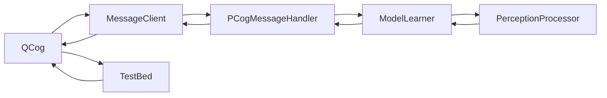
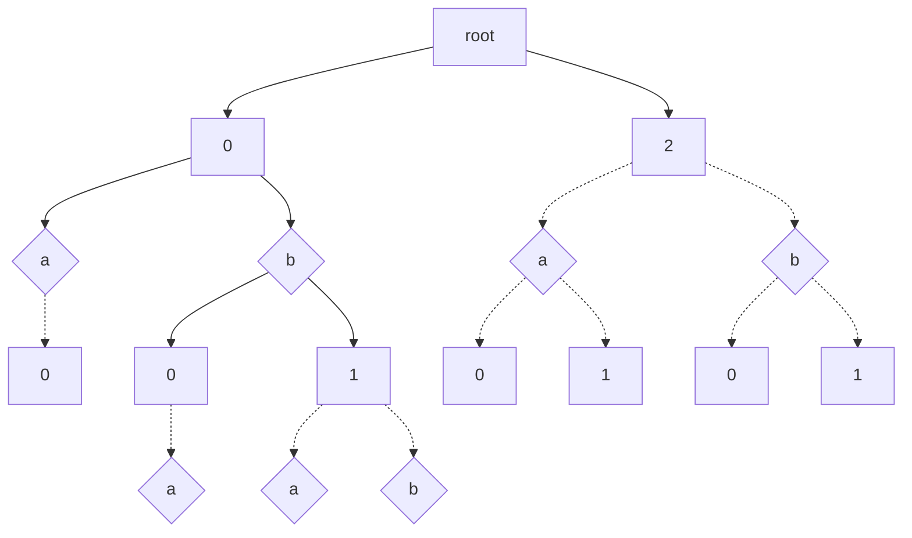

# System Design

PCog is a POMDP model learning framework that interlops with the QCog environment. 

The basic idea of model learning is that the agent will spend some time "exploring" it's environment. In the case of **PCog** "exploration" is some policy $\Pi(o) \in A$ where $o \in Z$ and $Z$ is the observation space that is defined by the **PerceptionProcessor** and $A$ is the set of allowed actions implicit to the environment. The agent will spend some time navigating around it's environment. It will take some time to construct a **Utile Suffix Memory** $U$ of what it perceives. 

Once the agent has perceived enough of it's environment it will derive a **POMDP** - $P$ - from $U$ using a function $G$ ($G$ for generate). It will then follow a policy called $\Pi_{U, P}(o, \epsilon) \in A$ which is basically an exploration policy where it will take an action from $\Pi$ and one from a policy called $\Pi_P$. $\Pi_P(b_h)$ is the optimal policy derived from planning in **POMDP** $P$. It will pick from $\Pi$ with a probability of $\epsilon > 0$. We construct $b_h$ from some history of past perceptions $h \in H$ where $H$ is a list of previously observed perceptions.

In other words $\Pi_{U, P}(o) \in A$ can be defined in the following way
$$
\Pi_{U, P}(o, r) = \begin{cases}
\Pi(o) & \text{if } \epsilon < r \\
\Pi_P(B(o))
\end{cases}
$$
where

* $r \in [0, 1]$ is a random number sampled from the uniform distribution $U$
* $B : H \rightarrow (S \rightarrow \mathbb{R})$ is a function that produces a belief state from some history $H$ of observations

The diagram above explains the components that PCog makes use of. 

* **QCog** - the java code base
* **MessageClient** - PCog client in the code base
* **TestBed** - the Unity test application
* **PCogMessageHandler** - python module that interprets messages from the **PCogClient**
* **ModelLearner** - a state machine that dictates exploration and exploitation strategy of **PCog**. It also maintains the **Utile Suffix Memory** model
* **PerceptionProcessor** - this module takes raw perceptions coming from the MessageClient and discritises them into a form that is compatible with the reinforcement learning module. Also contains methods for scoring perceptions - IE a reward function. It also contains an exploration strategy.

# Algorithm Used

This is quite an involved topic - I don't really think it's necessary to write about it. Check out [this paper](http://citeseerx.ist.psu.edu/viewdoc/summary?doi=10.1.1.54.132) which describes the utile suffix memory method in depth. TLDR it's basically a suffix trie which records previous sequences of actions and uses the leaves of the suffix trie to alias to states. 